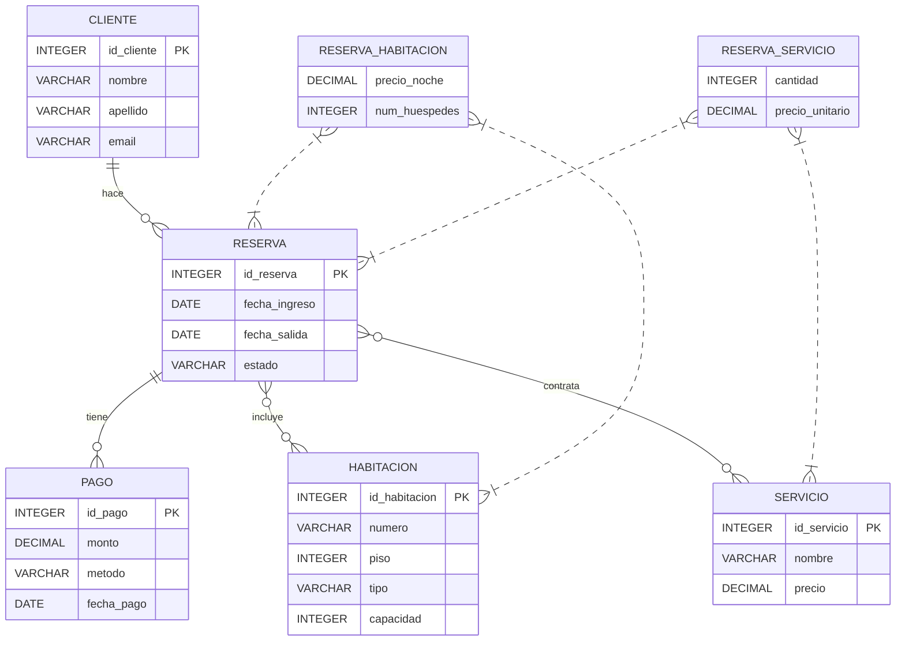

# Práctica — Ejercicio 1a: Sistema de reservas de un hotel (Desarrollo completo)

## 1) Narración del cliente (requisitos en lenguaje natural)

"Soy el gerente del Hotel Sol y Luna. Necesitamos un sistema para gestionar clientes, habitaciones, reservas y pagos. Un cliente puede reservar una o varias habitaciones en una sola reserva (por ejemplo, una familia). Cada habitación pertenece a un piso y tiene un tipo (individual, doble, suite). Las reservas tienen fecha de entrada y salida; no se debe permitir que una misma habitación esté reservada para fechas que se solapen. Queremos registrar pagos (método, monto, fecha) y servicios contratados por reserva (desayuno, lavandería, spa). El personal de recepción crea y modifica reservas, y necesitamos poder consultar la ocupación por fecha y generar facturas por reserva."

## 2) Suposiciones (decisiones para aclarar ambigüedades)

- Identificamos clientes por `id_cliente` (PK) y registramos email como único.
- Una reserva está asociada a exactamente un cliente.
- Una reserva puede incluir varias habitaciones (N:M entre RESERVA y HABITACION) y la asociación guarda `precio_noche` y `num_huespedes` para esa habitación en esa reserva.
- La comprobación de solapamiento se implementará en la capa de aplicación o mediante triggers (muestreo sugerido en la sección SQL).
- Los servicios contratados se modelan como catálogo (SERVICIO) y relación N:M con RESERVA (RESERVA_SERVICIO) incluyendo `cantidad` y `precio_unitario`.
- Un pago pertenece a una única reserva; una reserva puede tener varios pagos.

## 3) Identificación de Entidades, Atributos, Tipos y PK

Usamos notación UML simplificada de tres compartimentos para cada entidad:

┌─────────────┐
│  CLIENTE    │
├─────────────┤
│ + id_cliente: INTEGER PK (AUTOINCREMENT)
│ + nombre: VARCHAR(100) NOT NULL
│ + apellido: VARCHAR(100) NOT NULL
│ + email: VARCHAR(150) UNIQUE NOT NULL
│ + telefono: VARCHAR(20)
└─────────────┘

┌─────────────┐
│  HABITACION │
├─────────────┤
│ + id_habitacion: INTEGER PK (AUTOINCREMENT)
│ + numero: VARCHAR(10) UNIQUE NOT NULL
│ + piso: INTEGER NOT NULL
│ + tipo: VARCHAR(20) CHECK IN ('individual','doble','suite')
│ + capacidad: INTEGER CHECK (capacidad > 0)
└─────────────┘

┌─────────────┐
│  RESERVA    │
├─────────────┤
│ + id_reserva: INTEGER PK (AUTOINCREMENT)
│ + id_cliente: INTEGER FK → CLIENTE(id_cliente) NOT NULL
│ + fecha_reserva: DATE DEFAULT CURRENT_DATE
│ + fecha_ingreso: DATE NOT NULL
│ + fecha_salida: DATE NOT NULL
│ + estado: VARCHAR(20) CHECK IN ('confirmada','cancelada','check-in','check-out')
└─────────────┘

┌──────────────────────┐
│ RESERVA_HABITACION   │
├──────────────────────┤
│ + id_reserva: INTEGER FK → RESERVA(id_reserva) PK parcial
│ + id_habitacion: INTEGER FK → HABITACION(id_habitacion) PK parcial
│ + precio_noche: DECIMAL(8,2) NOT NULL
│ + num_huespedes: INTEGER DEFAULT 1 CHECK (num_huespedes > 0)
│ + comentario: VARCHAR(255)
└──────────────────────┘

┌────────────┐
│  PAGO      │
├────────────┤
│ + id_pago: INTEGER PK (AUTOINCREMENT)
│ + id_reserva: INTEGER FK → RESERVA(id_reserva) NOT NULL
│ + metodo: VARCHAR(30) CHECK IN ('efectivo','tarjeta','transferencia')
│ + monto: DECIMAL(10,2) CHECK (monto >= 0) NOT NULL
│ + fecha_pago: DATE DEFAULT CURRENT_DATE
└────────────┘

┌────────────┐
│  SERVICIO  │
├────────────┤
│ + id_servicio: INTEGER PK (AUTOINCREMENT)
│ + nombre: VARCHAR(100) NOT NULL
│ + descripcion: VARCHAR(255)
│ + precio: DECIMAL(8,2) CHECK (precio >= 0)
└────────────┘

┌────────────────────┐
│ RESERVA_SERVICIO    │
├────────────────────┤
│ + id_reserva: FK → RESERVA(id_reserva) PK parcial
│ + id_servicio: FK → SERVICIO(id_servicio) PK parcial
│ + cantidad: INTEGER DEFAULT 1 CHECK(cantidad > 0)
│ + precio_unitario: DECIMAL(8,2) NOT NULL
└────────────────────┘

## 4) Relaciones y cardinalidades (con justificación)

- CLIENTE (1) — (N) RESERVA
  - Justificación: un cliente puede hacer muchas reservas a lo largo del tiempo; cada reserva pertenece a un único cliente.

- RESERVA (N) — (M) HABITACION (mediante RESERVA_HABITACION)
  - Justificación: una reserva puede contener varias habitaciones (familias) y cada habitación puede estar presente en muchas reservas en distintos periodos. La entidad asociativa almacena atributos de la relación (precio por noche y número de huéspedes).

- RESERVA (1) — (N) PAGO
  - Justificación: una reserva puede abonarse en varios pagos (depósito + pago final), cada pago corresponde a una reserva.

- RESERVA (N) — (M) SERVICIO (mediante RESERVA_SERVICIO)
  - Justificación: una reserva puede contratar varios servicios; un servicio del catálogo puede aplicarse en muchas reservas.


## 5) Reglas de negocio y restricciones importantes

- Solapamiento de reservas: antes de confirmar una RESERVA_HABITACION para una habitación X, verificar que no exista otra reserva con la misma habitación cuyo rango [fecha_ingreso, fecha_salida) intersecte con el rango nuevo. Esto se puede implementar en la capa de aplicación o con un trigger que prevenga inserciones conflictivas.

- Consistencia de fechas: `fecha_ingreso < fecha_salida`. Validar con CHECK o trigger.

- Precio por noche y precio_unitario se fijan al momento de la reserva para evitar variaciones si cambia la tarifa posteriormente.

- Eliminación en cascada: si se borra una RESERVA, borrar pagos, reservas_habitacion y reserva_servicio (composición de la reserva sobre estos registros).

## 6) DER (diagrama) — notación Mermaid (para pegar en Markdown)



> Nota: Mermaid tiene limitaciones para mostrar entidades asociativas con atributos; en algunos rendereadores conviene dibujar RESERVA_HABITACION y RESERVA_SERVICIO como tablas separadas y mostrar líneas a RESERVA y HABITACION/SERVICIO.

## 7) Mapeo a esquema relacional (SQL ejemplo)

```sql
-- CLIENTE
CREATE TABLE CLIENTE (
  id_cliente INTEGER PRIMARY KEY AUTOINCREMENT,
  nombre VARCHAR(100) NOT NULL,
  apellido VARCHAR(100) NOT NULL,
  email VARCHAR(150) UNIQUE NOT NULL,
  telefono VARCHAR(20)
);

-- HABITACION
CREATE TABLE HABITACION (
  id_habitacion INTEGER PRIMARY KEY AUTOINCREMENT,
  numero VARCHAR(10) UNIQUE NOT NULL,
  piso INTEGER NOT NULL,
  tipo VARCHAR(20) NOT NULL CHECK (tipo IN ('individual','doble','suite')),
  capacidad INTEGER NOT NULL CHECK (capacidad > 0)
);

-- RESERVA
CREATE TABLE RESERVA (
  id_reserva INTEGER PRIMARY KEY AUTOINCREMENT,
  id_cliente INTEGER NOT NULL REFERENCES CLIENTE(id_cliente),
  fecha_reserva DATE DEFAULT (DATE('now')),
  fecha_ingreso DATE NOT NULL,
  fecha_salida DATE NOT NULL,
  estado VARCHAR(20) NOT NULL CHECK (estado IN ('confirmada','cancelada','check-in','check-out')),
  CHECK (fecha_ingreso < fecha_salida)
);

-- RESERVA_HABITACION (entidad asociativa)
CREATE TABLE RESERVA_HABITACION (
  id_reserva INTEGER NOT NULL REFERENCES RESERVA(id_reserva) ON DELETE CASCADE,
  id_habitacion INTEGER NOT NULL REFERENCES HABITACION(id_habitacion),
  precio_noche DECIMAL(8,2) NOT NULL CHECK (precio_noche >= 0),
  num_huespedes INTEGER DEFAULT 1 CHECK (num_huespedes > 0),
  comentario VARCHAR(255),
  PRIMARY KEY (id_reserva, id_habitacion)
);

-- PAGO
CREATE TABLE PAGO (
  id_pago INTEGER PRIMARY KEY AUTOINCREMENT,
  id_reserva INTEGER NOT NULL REFERENCES RESERVA(id_reserva) ON DELETE CASCADE,
  metodo VARCHAR(30) CHECK (metodo IN ('efectivo','tarjeta','transferencia')),
  monto DECIMAL(10,2) NOT NULL CHECK (monto >= 0),
  fecha_pago DATE DEFAULT (DATE('now'))
);

-- SERVICIO
CREATE TABLE SERVICIO (
  id_servicio INTEGER PRIMARY KEY AUTOINCREMENT,
  nombre VARCHAR(100) NOT NULL,
  descripcion VARCHAR(255),
  precio DECIMAL(8,2) CHECK (precio >= 0)
);

-- RESERVA_SERVICIO (entidad asociativa)
CREATE TABLE RESERVA_SERVICIO (
  id_reserva INTEGER NOT NULL REFERENCES RESERVA(id_reserva) ON DELETE CASCADE,
  id_servicio INTEGER NOT NULL REFERENCES SERVICIO(id_servicio),
  cantidad INTEGER DEFAULT 1 CHECK (cantidad > 0),
  precio_unitario DECIMAL(8,2) NOT NULL CHECK (precio_unitario >= 0),
  PRIMARY KEY (id_reserva, id_servicio)
);
```

### Trigger sugerido (ejemplo en SQLite) para evitar solapamientos

```sql
CREATE TRIGGER trg_no_solapamiento_insert
BEFORE INSERT ON RESERVA_HABITACION
FOR EACH ROW
BEGIN
  SELECT CASE
    WHEN EXISTS (
      SELECT 1 FROM RESERVA r
      JOIN RESERVA_HABITACION rh ON r.id_reserva = rh.id_reserva
      WHERE rh.id_habitacion = NEW.id_habitacion
        AND NOT (r.fecha_salida <= (SELECT fecha_ingreso FROM RESERVA WHERE id_reserva = NEW.id_reserva)
                 OR r.fecha_ingreso >= (SELECT fecha_salida FROM RESERVA WHERE id_reserva = NEW.id_reserva))
    ) THEN RAISE(ABORT, 'Solapamiento de reserva para la misma habitación')
  END;
END;
```

> Observación: El trigger anterior necesita adaptaciones según la base de datos (en SQLite la sintaxis y funciones pueden variar). Otra alternativa es comprobar solapamientos en la capa de aplicación usando una consulta SELECT con rango de fechas.

## 8) Datos de ejemplo (para pruebas rápidas)

```sql
INSERT INTO CLIENTE (nombre, apellido, email, telefono) VALUES ('Ana','García','ana@example.com','72345678');
INSERT INTO HABITACION (numero, piso, tipo, capacidad) VALUES ('101',1,'doble',2);
INSERT INTO HABITACION (numero, piso, tipo, capacidad) VALUES ('102',1,'suite',4);

INSERT INTO RESERVA (id_cliente, fecha_ingreso, fecha_salida, estado) VALUES (1,'2026-09-01','2026-09-05','confirmada');
INSERT INTO RESERVA_HABITACION (id_reserva, id_habitacion, precio_noche, num_huespedes) VALUES (1,1,120.00,2);
INSERT INTO PAGO (id_reserva, metodo, monto) VALUES (1,'tarjeta',240.00);
```

## 9) Tareas opcionales que puedo hacer a continuación

- Generar el DER en formato PNG/SVG (requiere usar una herramienta externa) o en ASCII de alta fidelidad.
- Añadir scripts de prueba más completos y casos borde (solapamientos, cancelaciones, ajustes de precios).
- Mapear este caso a una práctica con enunciado, rúbrica y archivo de entrega (SQL + README) para los estudiantes.


---

_Fin de la práctica desarrollada para Ejercicio 1a (Sistema de reservas de hotel)._